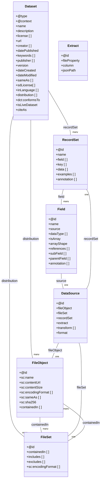

# 🥐 croissant-go docs

A lightweight Go library for working with the Croissant data format, designed to provide formatting, validation, querying, and resource management capabilities.

- [Repo Readme](./README-repo.md)
- --- 
- [Official Spec](https://github.com/mlcommons/croissant/blob/main/docs/croissant-spec.md)

## Croissant Class Diagram

